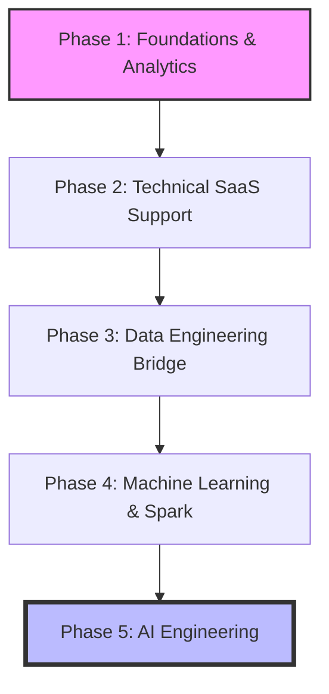

# Portfolio Roadmap

This roadmap shows the order in which the portfolio projects should be built. The order prioritises practical employability, current SaaS support relevance and long-term progression into data engineering and AI systems.

## Phase 1 - Data Analyst and Python Foundations

### 1. SaaS Support Intelligence Dashboard

**Build after:** SQL joins/aggregation, Power Query cleaning, Power BI relationships and basic DAX.

**Purpose:** Build a Power BI dashboard showing ticket volume, SLA risk, escalations, customer impact and operational recommendations.

**Evidence:** SQL KPI views, Power BI screenshots, data dictionary, assumptions and business recommendations.

### 2. Python Ticket Analytics Engine

**Build after:** Python fundamentals, pandas, file handling and basic logging.

**Purpose:** Automate support-ticket reporting using Python and pandas.

**Evidence:** Python scripts, report output, validation checks, logging output and README run instructions.

## Phase 2 - Technical SaaS and Application Support Engineering

### 3. API Integration Troubleshooter

**Build during:** APIs, REST, JSON, Postman/Bruno, status codes and Python API requests.

**Purpose:** Demonstrate how to test, log and diagnose API failures.

**Evidence:** Postman/Bruno examples, Python API client, status-code analysis, payload validation and troubleshooting matrix.

## Phase 2 to Phase 4 - Data Engineering Bridge

### 4. Modern ETL Warehouse

**Build after:** ETL troubleshooting, advanced SQL, staging tables and dimensional modelling basics.

**Purpose:** Build a raw-to-staging-to-warehouse pipeline with validation and reconciliation checks.

**Evidence:** SQL Server staging/warehouse scripts, star schema, validation checks, pipeline notes and dashboard/output report.

## Phase 3 - Data Science and Applied ML

### 5. Customer Churn Prediction

**Build after:** pandas, train/test split, model evaluation and classification metrics.

**Purpose:** Predict churn and explain business recommendations using model metrics and threshold tradeoffs.

**Evidence:** EDA notebook, model comparison table, confusion matrix, metrics, recommendations and limitations.

## Phase 4 - Spark and Big Data

### 6. PySpark Retail Analytics

**Build after:** Spark DataFrame basics, Databricks notebooks and partitioning awareness.

**Purpose:** Demonstrate distributed analytics using retail transaction data.

**Evidence:** PySpark transformations, Databricks notebook export, aggregations, engineering notes and business insights.

## Phase 3 to Phase 5 - AI Engineering

### 7. AI Ticket Classification Assistant

**Build after:** NLP classification, model evaluation, FastAPI basics and AI safety awareness.

**Purpose:** Classify support-style tickets and demonstrate AI evaluation, API serving and safe-use documentation.

**Evidence:** Classifier, confusion matrix, misclassification review, FastAPI endpoint, AI risk notes and README.

## Workplace Stack Supplement

Alongside the main roadmap, I am also building awareness of workplace SaaS technologies including .NET, ASP.NET Core, Azure SQL, Azure Functions, Azure Pipelines, Docker, structured logging, testing and deployment tooling.
